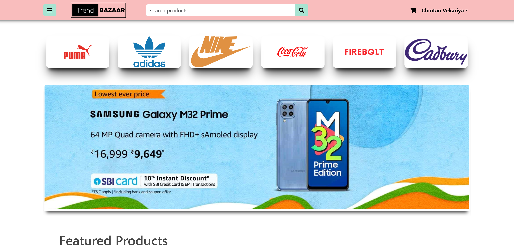
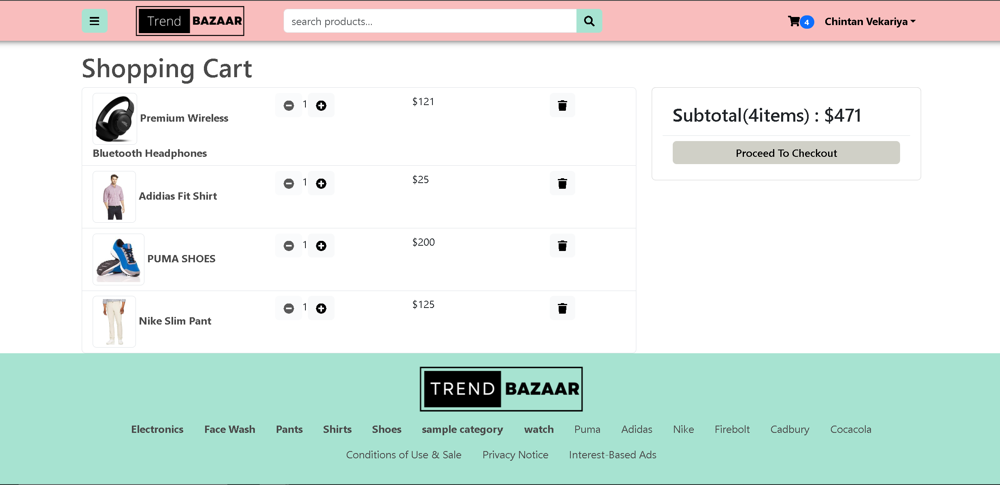
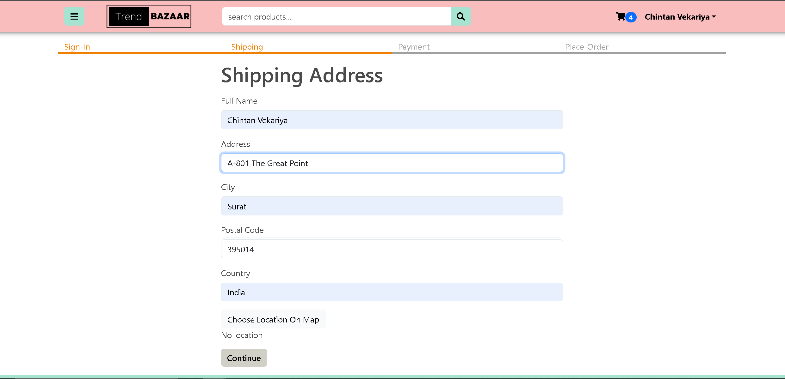
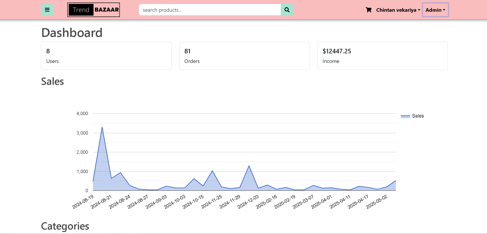

# 🛍️ TrendBazaar — Full-Stack E-Commerce Platform

<div align="center">


[](https://trend-bazaar-fe6p.onrender.com)
[](https://github.com/ChintanVekariya9189/Trend-Bazaar)
[](LICENSE)

**A production-ready e-commerce web application built with the MERN stack.**  
Browse products, manage a cart, process payments, and administer the platform — all in one app.

[🚀 Live Demo](https://trend-bazaar-fe6p.onrender.com) · [🐛 Report Bug](https://github.com/ChintanVekariya9189/Trend-Bazaar/issues) · [✨ Request Feature](https://github.com/ChintanVekariya9189/Trend-Bazaar/issues)

</div>

---

## 📸 Screenshots

| Home Page | Product Listings | Shopping Cart | Checkout | Admin Panel |
|-----------|------------------|---------------|----------|-------------|
|  |  |  |  |  |

---

## ✨ Features

### 👤 User Features
- 🔐 **Secure Authentication** — Register, login, and JWT-based session management
- 🛍️ **Product Browsing** — Browse, search, and filter products by category
- 🛒 **Shopping Cart** — Add/remove items with real-time price calculation
- 💳 **PayPal Payments** — Integrated PayPal API for secure checkout
- 📦 **Order Tracking** — View order history and current order status
- 📧 **Email Notifications** — Order confirmation emails via Mailgun

### 🔧 Admin Features
- 📊 **Admin Dashboard** — Overview of orders, users, and revenue
- 🏷️ **Product Management** — Create, update, delete products with image uploads
- 👥 **User Management** — View and manage all registered users
- 📋 **Order Management** — Update order delivery status

---

## 🛠️ Tech Stack

| Layer | Technology |
|-------|-----------|
| **Frontend** | React.js, Redux (State Management), React-Bootstrap, Axios |
| **Backend** | Node.js, Express.js, RESTful API |
| **Database** | MongoDB, Mongoose ODM |
| **Authentication** | JSON Web Tokens (JWT) |
| **Payments** | PayPal REST API |
| **Media Storage** | Cloudinary |
| **Email Service** | Mailgun |
| **Deployment** | Render (Backend + Frontend) |

---

## 🏗️ Architecture

```
Trend-Bazaar/
├── client/                  # React frontend
│   ├── src/
│   │   ├── components/      # Reusable UI components
│   │   ├── pages/           # Page-level components
│   │   ├── redux/           # Redux store, actions, reducers
│   │   └── utils/           # Helper functions
│   └── package.json
│
├── server/                  # Node.js + Express backend
│   ├── controllers/         # Route handler logic
│   ├── models/              # Mongoose data models
│   ├── routes/              # API route definitions
│   ├── middleware/          # Auth, error handling middleware
│   └── package.json
│
└── README.md
```

---

## 🚀 Getting Started

### Prerequisites

Make sure you have the following installed:
- [Node.js](https://nodejs.org/) (v16+)
- [MongoDB](https://www.mongodb.com/) (local or Atlas)
- [Git](https://git-scm.com/)

### Installation

1. **Clone the repository**
   ```bash
   git clone https://github.com/ChintanVekariya9189/Trend-Bazaar.git
   cd Trend-Bazaar
   ```

2. **Install backend dependencies**
   ```bash
   cd server
   npm install
   ```

3. **Install frontend dependencies**
   ```bash
   cd ../client
   npm install
   ```

### Environment Variables

Create a `.env` file inside the `/server` directory:

```env
# Server
PORT=5000
NODE_ENV=development

# Database
MONGODB_URI=your_mongodb_connection_string

# Authentication
JWT_SECRET=your_jwt_secret_key

# PayPal
PAYPAL_CLIENT_ID=your_paypal_client_id

# Cloudinary (Image Uploads)
CLOUDINARY_CLOUD_NAME=your_cloudinary_cloud_name
CLOUDINARY_API_KEY=your_cloudinary_api_key
CLOUDINARY_API_SECRET=your_cloudinary_api_secret

# Mailgun (Email)
MAILGUN_DOMAIN=your_mailgun_domain
MAILGUN_API_KEY=your_mailgun_api_key
```

> ⚠️ Never commit your `.env` file. It is already included in `.gitignore`.

### Running Locally

**Start the backend** (runs on `http://localhost:5000`)
```bash
cd server
npm start
```

**Start the frontend** (runs on `http://localhost:3000`)
```bash
cd client
npm start
```

Then open [http://localhost:3000](http://localhost:3000) in your browser.

---

## 🔌 API Overview

| Method | Endpoint | Description |
|--------|----------|-------------|
| `POST` | `/api/users/login` | User login |
| `POST` | `/api/users/register` | User registration |
| `GET` | `/api/products` | Get all products |
| `GET` | `/api/products/:id` | Get single product |
| `POST` | `/api/orders` | Create new order |
| `GET` | `/api/orders/:id` | Get order by ID |
| `PUT` | `/api/orders/:id/pay` | Update order to paid |
| `GET` | `/api/admin/orders` | Get all orders (Admin) |
| `POST` | `/api/admin/products` | Create product (Admin) |
| `PUT` | `/api/admin/products/:id` | Update product (Admin) |
| `DELETE` | `/api/admin/products/:id` | Delete product (Admin) |

---

## 🌐 Deployment

This app is deployed on **Render**:
- 🔗 **Live URL**: [https://trend-bazaar-fe6p.onrender.com](https://trend-bazaar-fe6p.onrender.com)

> Note: Free-tier Render apps may take ~30 seconds to wake up on first visit.

---

## 🤝 Contributing

Contributions are welcome!

1. Fork the repository
2. Create your feature branch (`git checkout -b feature/AmazingFeature`)
3. Commit your changes (`git commit -m 'Add some AmazingFeature'`)
4. Push to the branch (`git push origin feature/AmazingFeature`)
5. Open a Pull Request

---

## 👨‍💻 Author

**Chintan Vekariya**

[](https://linkedin.com/in/chintan--vekariya)
[](https://github.com/ChintanVekariya9189)
[](mailto:cvekariya16@gmail.com)

---

## 📄 License

This project is licensed under the MIT License. See the [LICENSE](LICENSE) file for details.

---

<div align="center">
  <sub>Built with ❤️ using the MERN Stack</sub>
</div>